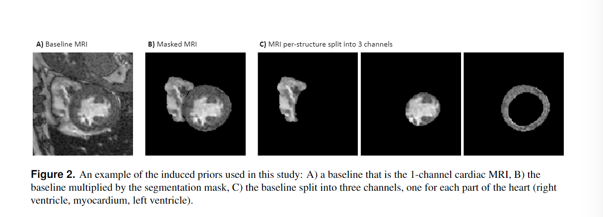
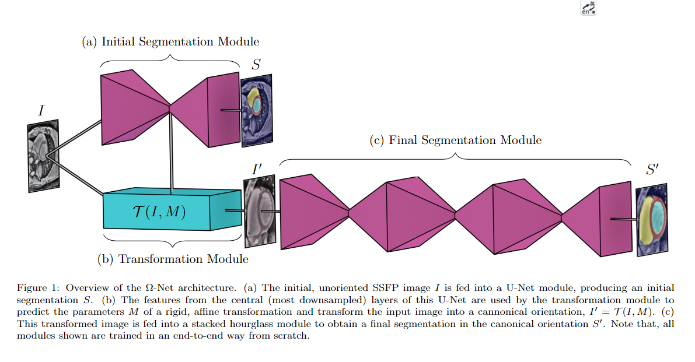
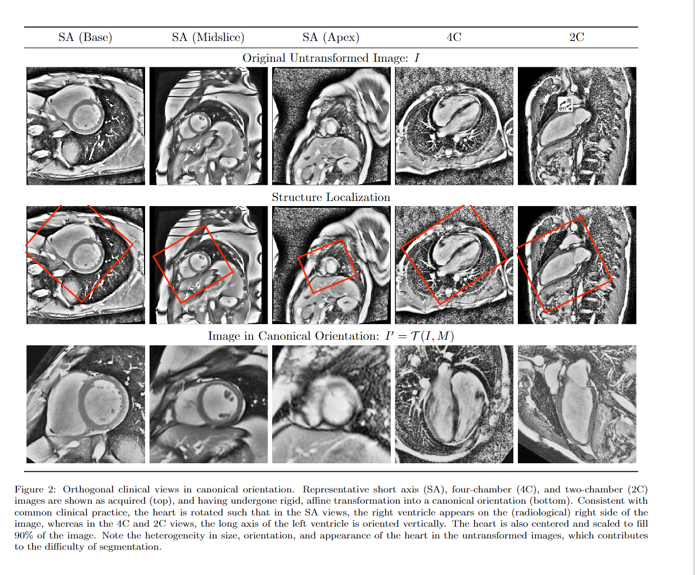
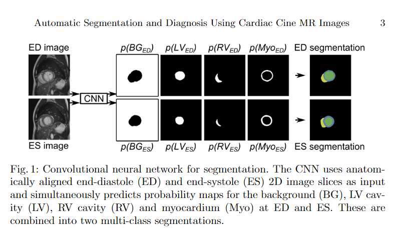
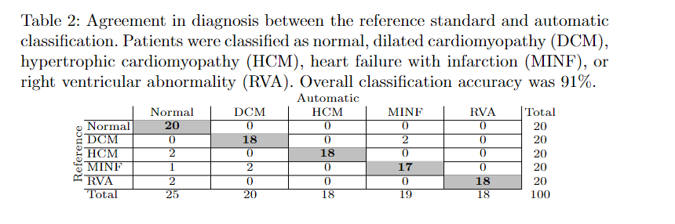

### 将心脏分割为三个部分

Federated Learning for Multi-Center ImagingDiagnostics: A Study in Cardiovascular Disease

### 分割心脏并且配准

Ω-Net (Omega-Net):  Fully Automatic, Multi-View Cardiac MR Detection,Orientation, and Segmentation with Deep Neural Networks

### 自动分割并且进行分类(17年)

Automatic Segmentation and DiseaseClassification Using Cardiac Cine MR Images

#### 步骤

1.先用神经网络分割出来左室腔、房室腔和心肌

2.从自动获得的分割中提取图像特征：左室腔、房室腔和心肌在舒张末期和收缩末期的体积（毫升），左室腔和房室腔的射血分数（EF），左室腔和房室腔在舒张末期和收缩末期的体积之比，以及心肌和左室腔在舒张末期和收缩末期的体积之比。因此，总共使用了14个特征：2个基于病人的特征和12个基于图像的特征。

3.因此，总共使用了 14 个特征：2 个基于患者的特征和 12 个基于图像的特征。

 训练了一个五类（正常、HCM、DCM、MINF、RVA）随机森林分类器。

#### 结果

正常、扩张型心肌病（DCM）、肥厚型心肌病（HCM）、心力衰竭伴梗死（MINF）或右心室异常（RVA)。总体分类准确率为91%。